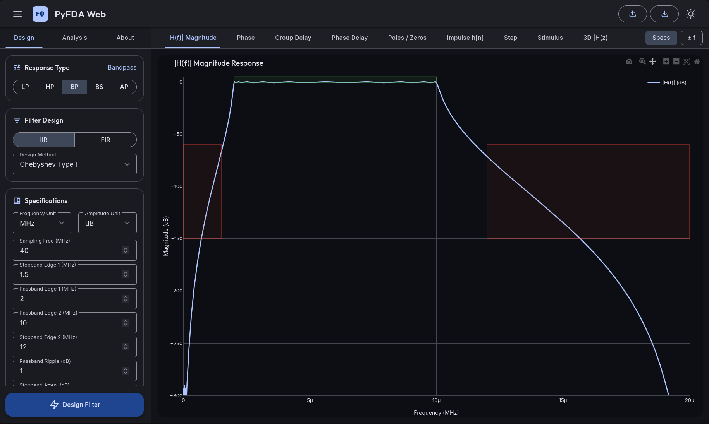
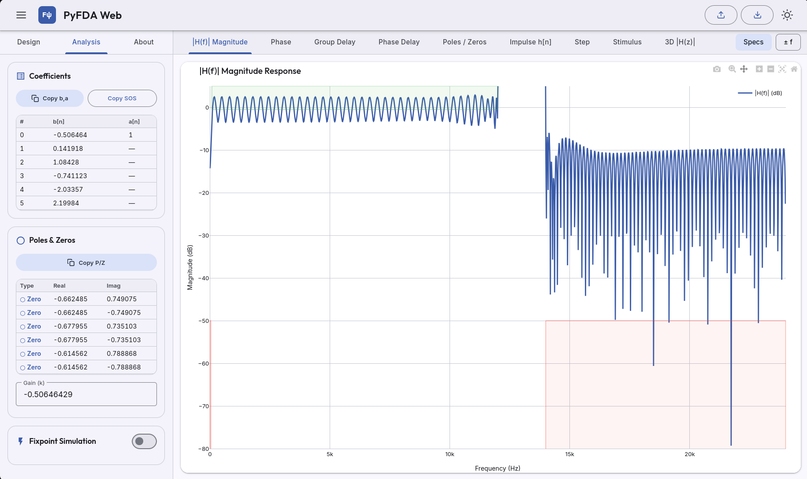
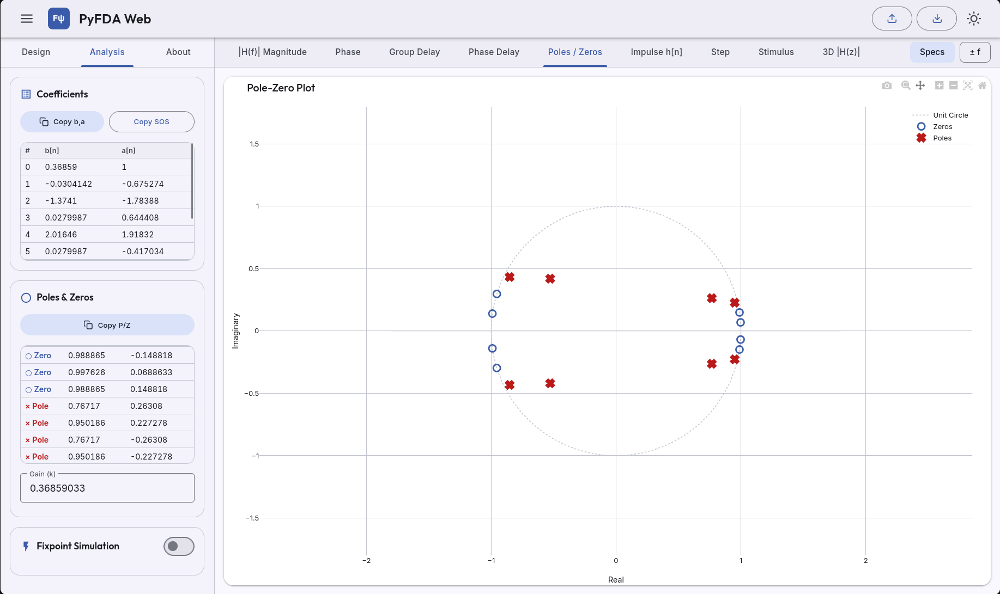
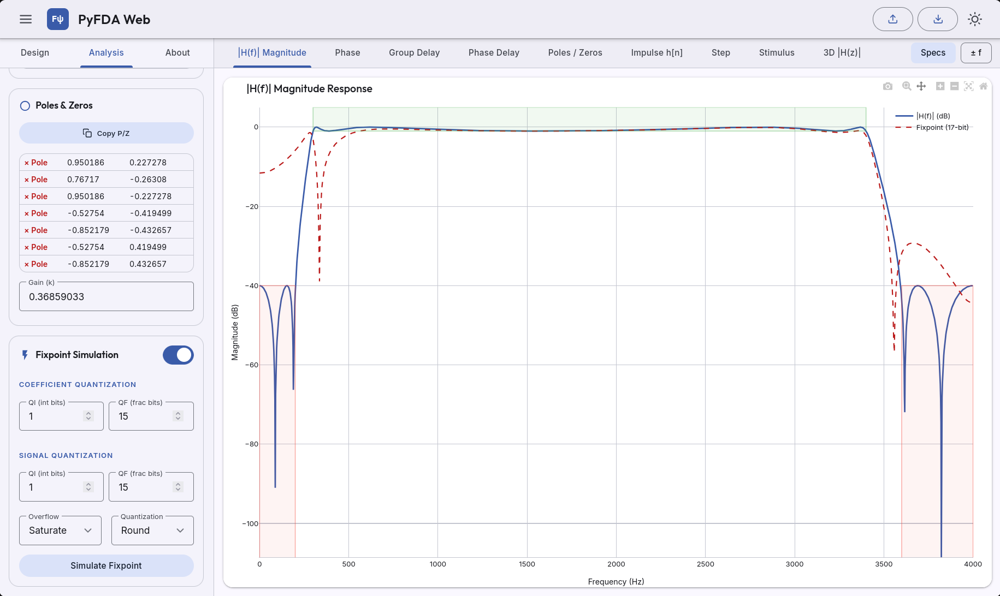
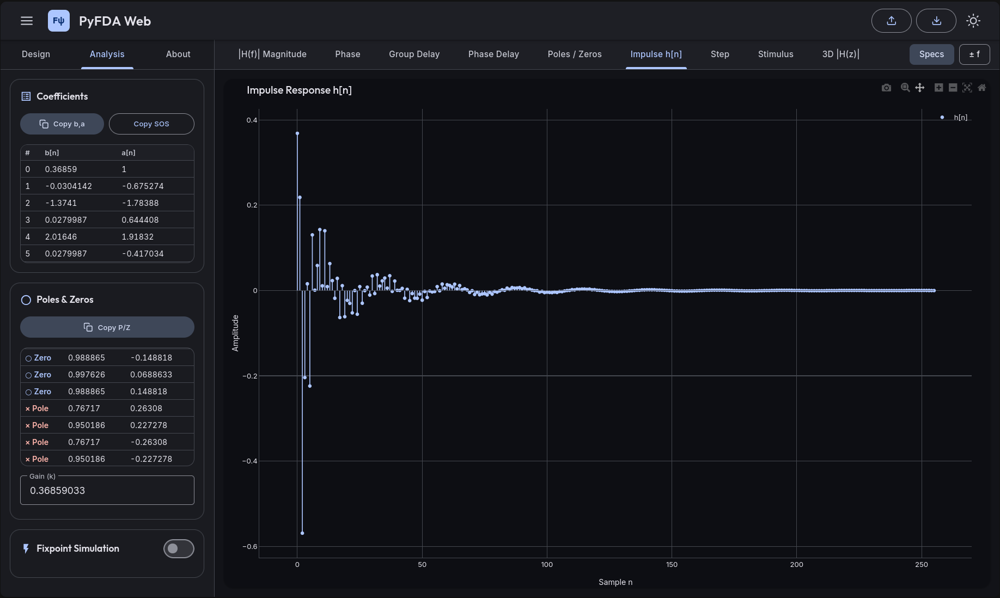
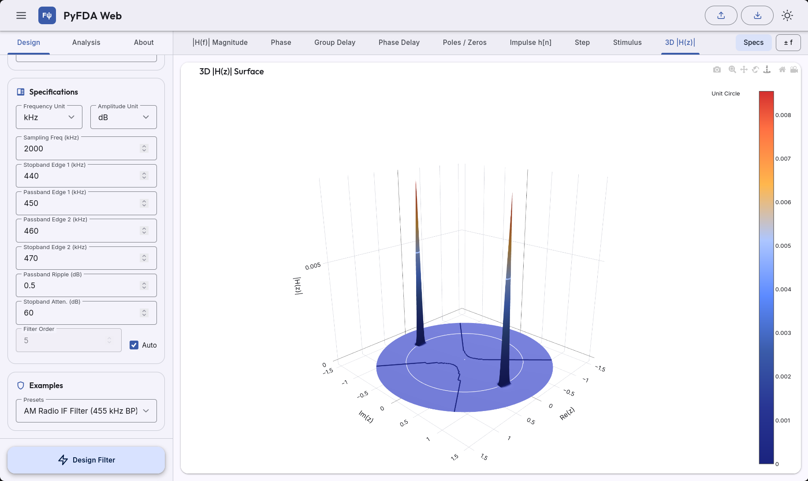

# PyFDA Web

A static, client-side web application for Digital Signal Processing (DSP) filter design and analysis. This tool brings the core logic of the Python `pyfda` application to the browser using WebAssembly and Pyodide, eliminating the need for a backend server.

<table>
    <tr>
        <td></td>
        <td></td>
        <td></td>
   </tr>
    <tr>
        <td></td>
        <td></td>
        <td></td>
    </tr>
</table>

## Usage

PyFDA Web runs entirely in your browser. You can access and use the live application directly here:

[**https://borish127.github.io/PyFDA-Web/**](https://borish127.github.io/PyFDA-Web/)

## Features

* **Filter Design:** Design Lowpass, Highpass, Bandpass, Bandstop, and Allpass filters.
* **Filter Families:** Support for IIR (Butterworth, Chebyshev, Elliptic, Bessel) and FIR (Windowed, Equiripple, Moving Average, Least-Squares) methods.
* **Interactive Analysis:** Visualize Frequency Response (Magnitude/Phase), Group/Phase Delay, Pole-Zero plots, Time-domain responses (Impulse, Step, Stimulus), and 3D Magnitude surfaces.
* **Fixpoint Simulation:** Simulate quantization effects with configurable word lengths and overflow/rounding behaviors.
* **File I/O:** Import and export filter designs locally in `.npz`, `.csv`, `.mat`, and `.json` formats.
* **Responsive Design:** Optimized for both desktop and mobile web browsers.

## Technology Stack

- Core Interface: HTML5, CSS3, JavaScript.

- Design System: Material Design 3 (MD3).

- Data Visualization: Plotly.js.

- DSP Runtime: Python (scipy.signal, numpy) executed via Pyodide.

# Contributing

We welcome contributions to PyFDA Web. Whether you want to fix bugs, optimize the interface, add new DSP features, or suggest improvements, your help is appreciated.

How to contribute:

1. Fork the project.

2. Create your feature branch (git checkout -b feature/NewFeature).

3. Commit your changes (git commit -m 'Add some NewFeature').

4. Push to the branch (git push origin feature/NewFeature).

5. Open a Pull Request.

For major changes or feature proposals, please open an issue first to discuss what you would like to change.

## License
This project is licensed under the GNU General Public License v3.0 - View [LICENSE.md](LICENSE.md) for details.

## Credits
**Original PyFDA Tool**  
PyFDA Web is a web-based adaptation inspired by the visual workflow and interface of the original [PyFDA](https://github.com/chipmuenk/pyfda) by Christian Münker [chipmuenk](https://github.com/chipmuenk), with backend DSP algorithms powered directly by [SciPy](https://scipy.org/) and [NumPy](https://numpy.org/).
